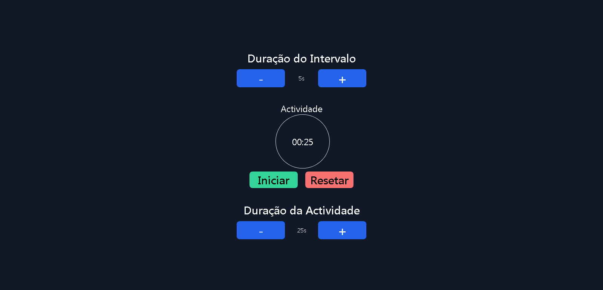

[![Contributors][contributors-shield]][contributors-url]
[![Forks][forks-shield]][forks-url]
[![Stargazers][stars-shield]][stars-url]
[![Issues][issues-shield]][issues-url]
[![MIT License][license-shield]][license-url]
[![LinkedIn][linkedin-shield]][linkedin-url]


<!-- PROJECT LOGO -->
<br />
<p align="center">
  <a href="https://github.com/adolforicardo/desafio-pomodoro">
    
  </a>

  <h3 align="center">Desafio Pomodoro</h3>

  <p align="center">
    <br />
    <a href="https://github.com/adolforicardo/desafio-pomodoro"><strong>Explore os documentos »</strong></a>
    <br />
    <br />
    <a href="">Ver Demo</a>
    ·
    <a href="https://github.com/adolforicardo/desafio-pomodoro/issues">Reportar bugs</a>
    ·
    <a href="https://github.com/adolforicardo/desafio-pomodoro/issues">Solicitar Recurso</a>
  </p>
</p>


<!-- TABLE OF CONTENTS -->
<details open="open">
  <summary>Índice</summary>
  <ol>
    <li>
      <a href="#sobre-o-projecto">Sobre o Projecto</a>
      <ul>
        <li><a href="#construído-com">Construído com</a></li>
      </ul>
    </li>
    <li>
      <a href="#começando">Começando</a>
      <ul>
        <li><a href="#pre-requisitos">Pre-requisitos</a></li>
        <li><a href="#instalação">Instalação</a></li>
      </ul>
    </li>
    <li><a href="#como-usar">Como usar</a></li>
    <li><a href="#roadmap">Roadmap</a></li>
    <li><a href="#constribuição">Constribuição</a></li>
    <li><a href="#licença">Licença</a></li>
    <li><a href="#contactis">Contactos</a></li>
    <li><a href="#acknowledgements">Acknowledgements</a></li>
  </ol>
</details>


<!-- ABOUT THE PROJECT -->
## Construído com

[![Desafio Pomodoro][product-screenshot]](https://desafio-pomodoro-adolforicardo.herokuapp.com/)

A Técnica Pomodoro é um método de gerenciamento de tempo desenvolvido porFrancesco Cirillo no final dos anos 1980. A técnica usa um cronômetro para dividir o trabalho em intervalos, tradicionalmente de 25 minutos de duração, separados por intervalos curtos - 5 minutos.
Porém, buscando uma maior praticidade para a avaliação, os temporizadores deverão estar em segundos e não em minutos. Ou seja, os 25 minutos de duração deverão ser 25 segundos e os 5 minutos de intervalo deverão ser 5 segundos.


### Construído com

* [ReactJS](https://reactjs.org/)
* [TailwindCSS](https://tailwindcss.com/)
* [Typescript](https://www.typescriptlang.org/)


<!-- GETTING STARTED -->
## Começando

### Pre-requisitos

* Node 11^
* npm
  ```sh
  npm install npm@latest -g
  ```

### Instalação

1. Clonar o repositório
   ```sh
   git clone https://github.com/adolforicardo/desafio-pomodoro.git
   ```
2. Install NPM packages
   ```sh
   npm install
   ```


<!-- USAGE EXAMPLES -->
## Como usar



Aplicativo contém:
* Um temporizador para demonstrar o tempo de duração da atividade e do intervalo (deve haver um feedback visual para distinguir duração da atividade e duração do intervalo);
* Um botão para pausar o temporizador;
* Um botão para zerar o temporizador (lembrando que o ponto inicial do temporizador são os 25 segundos).
* Configuração de tempo personalizada com TimePicker (esse componente deve ser feito do 0, podendo utilizar lib auxiliar como moment).
* Feedback sonoro para quando o tempo da atividade terminar;


<!-- ROADMAP -->
## Roadmap

Consulte os [problemas em aberto](https://github.com/adolforicardo/desafio-pomodoro/issues) para obter uma lista de recursos propostos (e problemas conhecidos).


<!-- CONTRIBUTING -->
## Contribuição

As contribuições são o que tornam a comunidade de código aberto um lugar incrível para aprender, inspirar e criar. Quaisquer contribuições que você fizer serão  **muito apreciadas**.

1. Faça Fork o Projecto
2. Criar o seu Branch (`git checkout -b feature/pomodoro`)
3. Commitar as alterações (`git commit -m 'Add some pomodoro'`)
4. Fazer Push do Branch (`git push origin feature/pomodoro`)
5. Abrir um Pull Request


<!-- LICENSE -->
## Licença

Distribuído sob a licença MIT. Consulte a `LICENSE` para obter mais informações.


<!-- CONTACT -->
## Contactos

Adolfo Ricardo - [@linkedIn](https://www.linkedin.com/in/adolfo-ricardo-82960a189/) - adolforicardo5@gmail.com

Link do Projecto: [https://github.com/adolforicardo/desafio-pomodoro.git](https://github.com/adolforicardo/desafio-pomodoro.git)


<!-- ACKNOWLEDGEMENTS -->
## Acknowledgements
* [GitHub Emoji Cheat Sheet](https://www.webpagefx.com/tools/emoji-cheat-sheet)
* [Choose an Open Source License](https://choosealicense.com)
* [GitHub Pages](https://pages.github.com)
* [Animate.css](https://daneden.github.io/animate.css)
* [Font Awesome](https://fontawesome.com)


<!-- MARKDOWN LINKS & IMAGES -->
[contributors-shield]: https://img.shields.io/github/contributors/adolforicardo/desafio-pomodoro.svg
[contributors-url]: https://github.com/adolforicardo/desafio-pomodoro/graphs/contributors
[forks-shield]: https://img.shields.io/github/forks/adolforicardo/desafio-pomodoro.svg
[forks-url]: https://github.com/adolforicardo/desafio-pomodoro/network/members
[stars-shield]: https://img.shields.io/github/stars/adolforicardo/desafio-pomodoro.svg
[stars-url]: https://github.com/adolforicardo/desafio-pomodoro/stargazers
[issues-shield]: https://img.shields.io/github/issues/adolforicardo/desafio-pomodoro.svg
[issues-url]: https://github.com/adolforicardo/desafio-pomodoro/issues
[license-shield]: https://img.shields.io/github/license/adolforicardo/desafio-pomodoro.svg
[license-url]: https://github.com/adolforicardo/desafio-pomodoro/blob/master/LICENSE.txt
[linkedin-shield]: https://img.shields.io/badge/-LinkedIn-black.svg?logo=linkedin&colorB=0A66C2
[linkedin-url]: https://www.linkedin.com/in/adolfo-ricardo-82960a189
[product-screenshot]: src/assets/tela.png